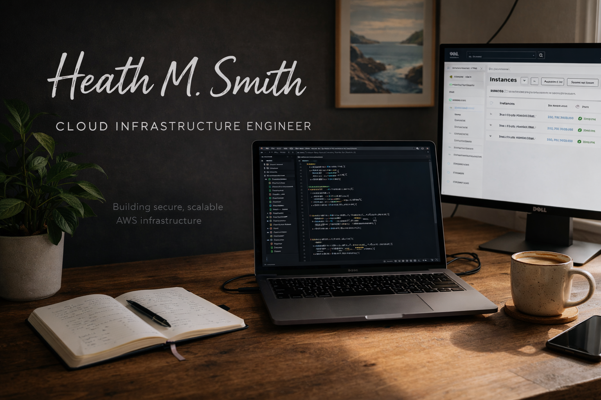

# Hi, I'm Heath

I build AWS cloud architectures with Terraform, with an emphasis on secure infrastructure, event-driven systems, serverless application design, automation, and operationally safe delivery through GitHub Actions and AWS OIDC.

My background includes private-cloud infrastructure, platform engineering, automation, and quality engineering. I use that experience to design AWS projects that demonstrate not only how infrastructure is provisioned, but also how it is secured, observed, deployed, and torn down.

[Portfolio](https://www.hmsdev.click/) · [LinkedIn](https://www.linkedin.com/in/heath-m-smith/) · [GitHub](https://github.com/HeathMSmith)

---

## Featured AWS Projects

### Three-Tier AWS Architecture

A multi-AZ AWS infrastructure project built with Terraform across three Availability Zones, with highly available network and application tiers. The architecture uses an internet-facing Application Load Balancer, private Auto Scaling compute, segmented application and database tiers, RDS, AWS Systems Manager, VPC endpoints, Secrets Manager, and controlled GitHub Actions workflows.

The design intentionally removes NAT Gateway dependency from the private application tier by using AWS service endpoints where appropriate, reducing recurring network cost while keeping compute private.

**Demonstrates:** VPC design · ALB · Auto Scaling · EC2 · RDS · SSM · VPC endpoints · Secrets Manager · Terraform · GitHub Actions · OIDC

[View Repository](https://github.com/HeathMSmith/terraform-aws-3tier-vpc-ha)

---

### AI Serverless Application

A serverless AI application that combines Amazon CloudFront, API Gateway, AWS Lambda, Amazon Bedrock, and DynamoDB. The application is managed with Terraform and deployed through GitHub Actions using AWS OIDC rather than long-lived deployment credentials.

The project demonstrates how managed AWS services can be combined into a secure, low-operations application architecture while still maintaining infrastructure lifecycle controls and separate DEV and PROD environments.

**Demonstrates:** Bedrock · API Gateway · Lambda · DynamoDB · CloudFront · S3 · KMS · Terraform · GitHub Actions · OIDC

[View Repository](https://github.com/HeathMSmith/aws-ai-serverless-app)

---

### Event-Driven Serverless Image Pipeline

An event-driven image-processing pipeline built with Amazon S3, AWS Lambda, Python, and Pillow. Image uploads trigger asynchronous processing that generates optimized 256px and 1024px JPEG derivatives in a separate processed-images bucket.

The project includes SQS dead-letter queue isolation and replay, CloudWatch logs and alarms, deterministic Pillow Lambda Layer builds, Terraform-managed infrastructure, and controlled deployment and teardown workflows.

**Demonstrates:** S3 events · Lambda · Python 3.12 · Pillow · SQS DLQ · CloudWatch · IAM · Terraform · GitHub Actions · OIDC

[View Repository](https://github.com/HeathMSmith/aws-serverless-image-pipeline)

---

### Static Website Platform

A production static website platform using private Amazon S3 storage behind CloudFront with Origin Access Control, Route 53 DNS, ACM-managed TLS, and Terraform-managed infrastructure.

The project demonstrates secure edge delivery, custom-domain routing, HTTPS, remote state, separate environments, and controlled infrastructure deployment through GitHub Actions.

**Demonstrates:** CloudFront · S3 · OAC · Route 53 · ACM · Terraform · GitHub Actions · OIDC

[View Repository](https://github.com/HeathMSmith/aws-static-site-terraform) · [Live Site](https://www.hmsdev.click/)

---

## Engineering Approach

Across the portfolio, I use a consistent infrastructure and delivery model where it fits the architecture:

- Terraform-managed AWS infrastructure
- separate DEV and PROD environment roots
- encrypted remote state in Amazon S3
- native S3 state locking
- version-constrained Terraform providers
- GitHub Actions for infrastructure lifecycle workflows
- AWS OIDC authentication with short-lived credentials
- pull-request Terraform planning
- controlled apply workflows
- reviewed destroy workflows
- private-by-default compute and storage where appropriate
- CloudWatch-based observability
- cost-aware architecture decisions
- explicit failure handling and recovery paths

The goal is not to make every project identical. Each architecture keeps the AWS services and operational patterns that best fit its workload while following a common engineering standard for infrastructure management and delivery.

---

## Core Technologies

**Cloud & Infrastructure**

AWS · Terraform · VPC · EC2 · Auto Scaling · ALB · RDS · S3 · CloudFront · Route 53 · ACM

**Serverless & Application Services**

Lambda · API Gateway · DynamoDB · Amazon Bedrock · SQS · CloudWatch · KMS · Secrets Manager

**Automation & Delivery**

GitHub Actions · AWS OIDC · Terraform remote state · native S3 locking · Bash · Python

**Infrastructure Practices**

Infrastructure as Code · private networking · multi-environment design · event-driven architecture · observability · failure recovery · controlled deployment and teardown

---

## What the Portfolio Demonstrates

The projects are intentionally different in scope:

- **Three-Tier AWS Architecture** focuses on networking, private compute, high availability, and infrastructure lifecycle management.
- **AI Serverless Application** focuses on managed application services and generative AI integration.
- **Serverless Image Pipeline** focuses on event-driven processing, asynchronous failure handling, and observability.
- **Static Website Platform** focuses on secure global content delivery, DNS, TLS, and edge architecture.

Together, they demonstrate the ability to design and operate multiple AWS architecture patterns rather than a single repeated Terraform template.

---

## Background

I bring experience from private-cloud infrastructure, VMware-based environments, platform engineering, automation, and quality engineering into my AWS work.

That background shapes how I approach cloud architecture: understand dependencies, automate repeatable operations, reduce unnecessary access, design for failure, make infrastructure observable, and keep deployment and teardown procedures deliberate.

I am currently focused on cloud engineering, AWS architecture, Infrastructure as Code, and DevOps-oriented roles where that combination of infrastructure and automation experience is useful.

---

## Connect

- [Portfolio](https://www.hmsdev.click/)
- [LinkedIn](https://www.linkedin.com/in/heath-m-smith/)
- [GitHub](https://github.com/HeathMSmith)
